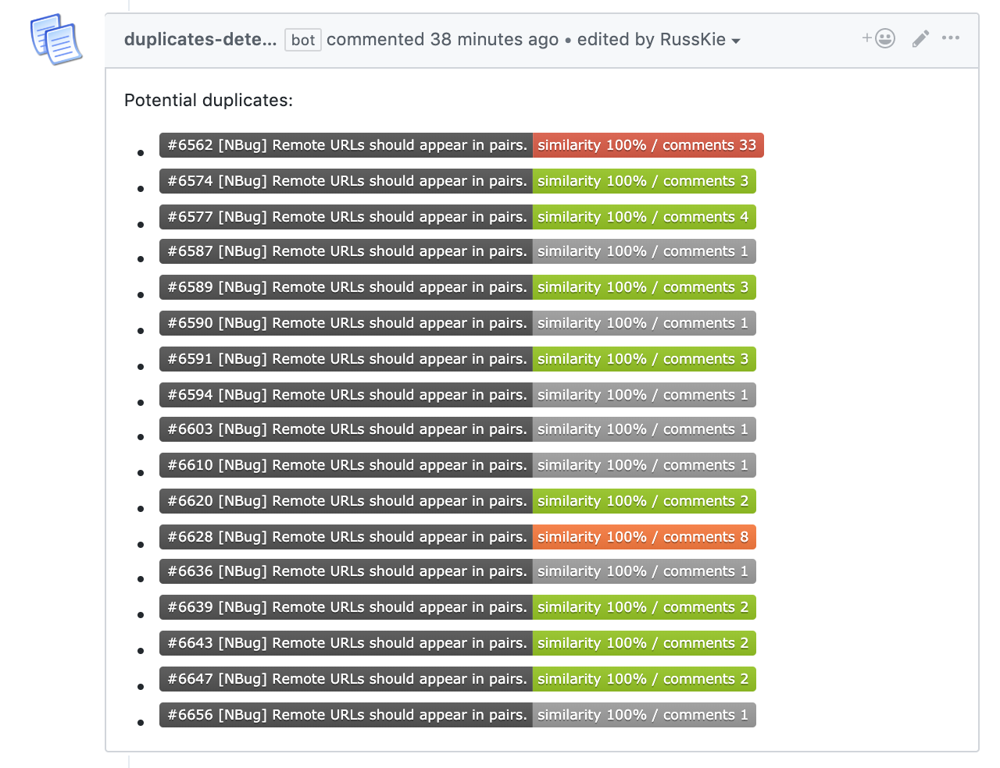

# potential-duplicates-bot

A configurable GitHub [Probot App](https://github.com/probot/probot) which checks for potential issue duplicates using [Damerau–Levenshtein](https://en.wikipedia.org/wiki/Damerau%E2%80%93Levenshtein_distance) distance algorithm to compare issues' titles.

> The Damerau–Levenshtein distance between two words is the minimum number of operations (consisting of insertions, deletions or substitutions of a single character, or transposition of two adjacent characters) required to change one word into the other. It also detects predefined synonyms for even better results.

The app has been built for an integration with [Git Extensions](https://github.com/gitextensions/gitextensions/) and NBug error report submissions, but with few tweaks can be turned into a general purpose duplicate checker bot.




# Usage

* You can deploy our Github App manually. For example to Glitch ([guide from Andrew Lock](https://andrewlock.net/creating-my-first-github-app-with-probot-part-3-deploying-to-glitch/))
* Then, you can create a custom configuration file at `.github/potential-duplicates.yml`. If this file doesn't exists, default settings will be used:

```yml
# Label name and color to set, when potential duplicates are detected
issueLabel: potential-duplicate
labelColor: cfd3d7

# If similarity is higher than this threshold, issue will be marked as duplicate
threshold: 0.60

# Comment to post when potential duplicates are detected
referenceComment: >
  Potential duplicates:
  {{#issues}}
    - {{ shield }} 
  {{/issues}}
```


## Deploying

If you would like to run your own instance of this app, see the [docs for deployment](https://probot.github.io/docs/deployment/). This app requires both `Issues – Read & Write` and `Single File – Read` (`.github/potential-duplicates.yml`) permissions & events.


## Setup

```sh
# Install dependencies
npm install

# Run the bot
npm run dev
```

## Contributing

If you have suggestions for how potential-duplicates-bot could be improved, or want to report a bug, open an issue! We'd love all and any contributions.

For more, check out the [Contributing Guide](CONTRIBUTING.md).

## License

[ISC](LICENSE) © 2019 Igor Velikorossov (https://github.com/RussKie/potential-duplicates-bot)

## Credits 
The original implementation has been copied from [Bartosz Łaniewski](https://github.com/Bartozzz/potential-duplicates-bot)